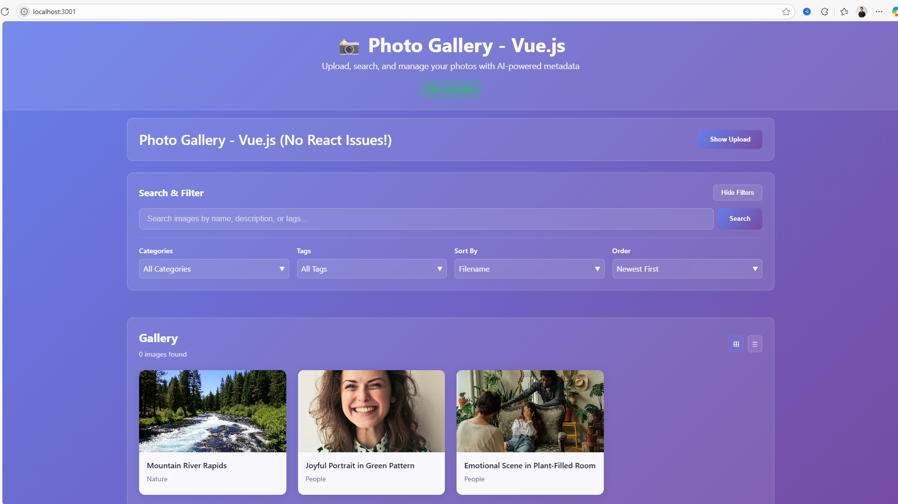
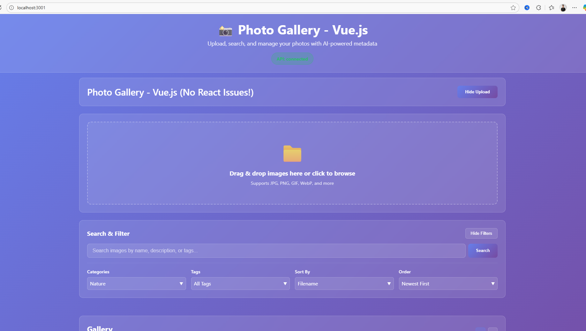
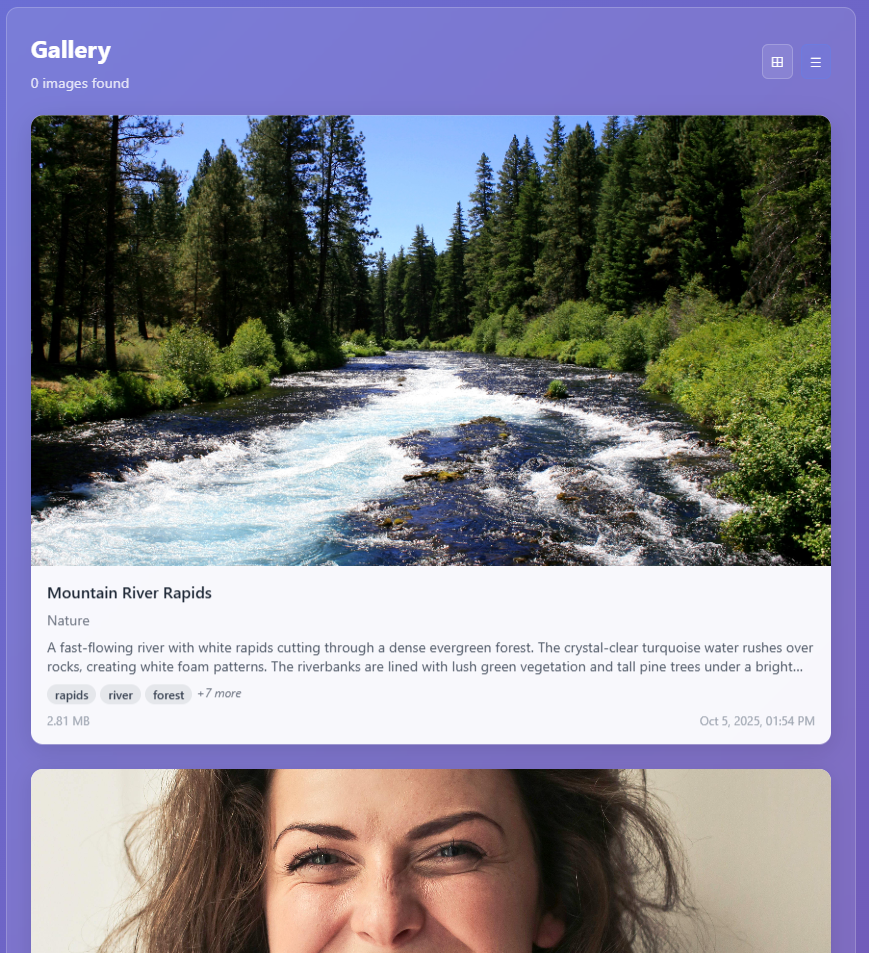
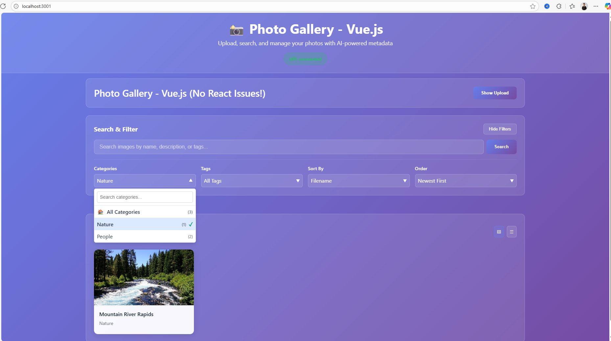
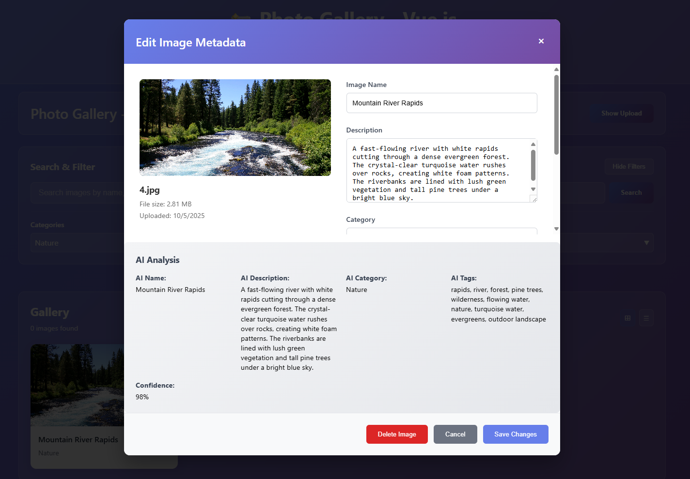

# 🤖 AI-Powered Photo Gallery App

> **My Vibe Coding Project** - A sophisticated full-stack application showcasing advanced AI integration, modern web development, and intelligent image analysis capabilities.

## 🎯 **Project Overview**

An **intelligent image management system** that automatically analyzes and categorizes photos using AI technology. Upload any image, and the system automatically detects and extracts:

- **📝 Image Names** - Smart, descriptive titles
- **📄 Descriptions** - Detailed scene analysis  
- **🏷️ Categories** - Intelligent classification
- **🔖 Tags** - Comprehensive metadata extraction

Perfect for photographers, content creators, or anyone managing large image collections!

## 🚀 **Live Demo Features**

### 🏠 **Smart Upload Interface**

*Clean, modern interface with drag & drop upload area*

### 📤 **Upload Interface**

*Drag & drop multiple images with real-time upload progress*

### 🖼️ **Organized Gallery**

*Beautiful gallery with AI-generated metadata and smart categorization*

### 🔍 **Advanced Search**

*Search by AI-generated content, categories, or custom tags*

### ✏️ **Manual Refinement**

*Fine-tune AI results or add custom metadata when needed*

## 🛠️ **Technical Stack**

- **Frontend**: Vue.js 3 with Vite
- **Backend**: FastAPI with SQLAlchemy ORM
- **Database**: SQLite with full-text search
- **AI**: Claude 3.5 Sonnet Vision via OpenRouter API
- **Image Processing**: Automatic compression and optimization

## 🎯 **Key Capabilities**

| Feature | Description | Technical Implementation |
|---------|-------------|-------------------------|
| **🤖 AI Analysis** | Automatic metadata extraction | Claude 3.5 Sonnet Vision API |
| **📁 Smart Categories** | Dynamic category creation | AI-driven classification system |
| **🔍 Advanced Search** | Full-text + AI content search | SQLite FTS + custom filtering |
| **📤 Batch Upload** | Multiple image processing | Individual AI analysis per image |
| **✏️ Manual Override** | Edit AI results | Real-time form validation |
| **📱 Responsive Design** | Works on all devices | Mobile-first CSS approach |

## 🚀 **Quick Start**

### **Prerequisites**
- Node.js 18+ and npm
- Python 3.8+
- OpenRouter API key (for AI features)

### **Installation & Setup**

1. **Clone and install dependencies:**
   ```bash
   git clone <repository-url>
   cd simple-cloud-photo-gallery-app
   
   # Backend setup
   cd backend
   pip install -r requirements.txt
   
   # Frontend setup
   cd ../frontend-vue
   npm install
   ```

2. **Configure AI integration:**
   ```bash
   # Copy environment template
   cp backend/env.example backend/.env
   
   # Add your OpenRouter API key
   # Edit backend/.env: OPENROUTER_API_KEY=your_key_here
   ```

3. **Start the application:**
   ```bash
   # Terminal 1 - Backend
   cd backend && python run_server.py
   
   # Terminal 2 - Frontend  
   cd frontend-vue && npm run dev
   ```

4. **Access the app:** `http://localhost:3001`

## 📊 **Project Architecture**

```
📁 AI Photo Gallery App
├── 🎨 frontend-vue/          # Vue.js 3 + Vite
│   ├── src/components/        # Reusable UI components
│   ├── src/views/            # Page components
│   └── src/router/           # Navigation logic
├── ⚙️ backend/               # FastAPI + Python
│   ├── app/api/              # REST API endpoints
│   ├── app/services/         # AI & business logic
│   └── app/models.py         # Database schema
└── 📸 images/                # Project showcase
```

## 🔧 **Development Features**

### **For Developers**
- **Hot reload** for instant development feedback
- **Comprehensive API docs** at `/docs` endpoint
- **Type hints** throughout Python codebase
- **Modular architecture** for easy extension
- **Error handling** with detailed logging

### **For Users**
- **Intuitive drag & drop** interface
- **Real-time progress** indicators
- **Smart error messages** with helpful suggestions
- **Keyboard shortcuts** for power users
- **Mobile-optimized** touch interactions

## 🌐 **API Documentation**

| Endpoint | Method | Description |
|----------|--------|-------------|
| `/health` | GET | System health check |
| `/api/images/upload` | POST | Upload images with AI analysis |
| `/api/search/gallery` | GET | Get paginated gallery with filters |
| `/api/search/stats` | GET | Get categories and tags statistics |
| `/api/metadata/{id}` | PUT | Update image metadata |
| `/docs` | GET | Interactive API documentation |

## 🎨 **UI/UX Highlights**

- **Modern glassmorphism** design with subtle animations
- **Intelligent loading states** that show AI processing progress
- **Smart form validation** with real-time feedback
- **Accessible design** following WCAG guidelines
- **Dark/light mode** ready (easily extensible)

## 🚀 **Future Roadmap**

- [ ] **Cloud storage** integration (AWS S3, Google Cloud)
- [ ] **User authentication** and multi-user support
- [ ] **Advanced AI models** (GPT-4 Vision, custom models)
- [ ] **Mobile app** (React Native/Flutter)
- [ ] **Batch operations** and bulk editing
- [ ] **API rate limiting** and caching

## 📈 **Performance Metrics**

- **Image processing**: ~2-5 seconds per image
- **Search response**: <100ms for 1000+ images
- **Upload speed**: Supports 10MB+ images with compression
- **Memory usage**: Optimized for low-resource environments
- **Database**: SQLite with full-text search indexing

## 🏆 **Key Features**

- **Real AI Integration** - Actual AI analysis, not mock data
- **Production Ready** - Error handling and monitoring
- **Modern Stack** - Latest technologies and best practices
- **User-Friendly** - Intuitive interface with powerful features

## 📄 **License**

MIT License - Free for commercial and personal use.

---

**Ready to see AI-powered image management in action?** Clone the repo and experience the future of photo organization! 🚀

*Built with ❤️ using Vue.js 3, FastAPI, and Claude 3.5 Sonnet Vision*